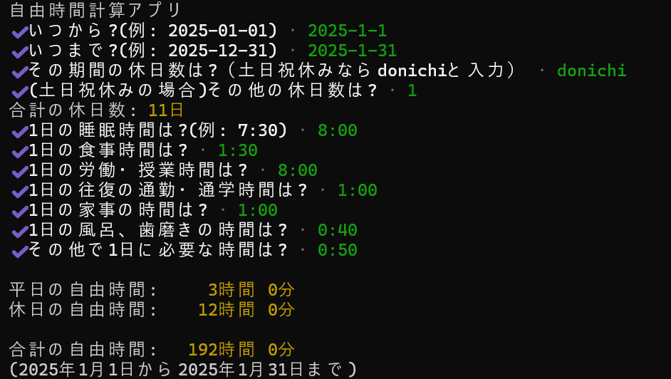

# free-time-calculator-jp

指定した期間の合計の自由時間を計算する npm です<br>
今後の学習計画などの参考に活用することができます



# インストールと実行方法

## ローカルインストール

```
npm install free-time-calculator-jp
npx free-time-calculator-jp
```

## グローバルインストール

```
npm install -g free-time-calculator-jp
free-time-calculator-jp
```

# 使い方

1. 自由時間を求めたい期間を入力します
2. 期間内の休日の数を入力します
   (土日祝休みの場合、土日祝と入力して、その後土日祝以外の休日数を入力します)
3. 睡眠時間や食事時間などの生活に必要な時間を入力します
4. 全ての入力を終えると、一日あたりの平日と休日の自由時間と、期間内の合計の自由時間が表示されます

- 途中で終了したい場合は、`Ctrl + C`を押すことで強制終了することができます

# 注意点

- 生活に必要な時間（睡眠時間、食事時間など）は日によって変動するため、計算結果はあくまで目安としてご利用ください
- 日本の祝日をもとに、土日祝の休日数の計算を行っています
